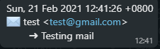

# Whatsapp Notification for Gmail

## Getting Started

### Prerequisites

What things you need to install the software and how to install them

```
Gmail OAuth Token: https://developers.google.com/gmail/api/quickstart/python
Python 3 (Reading of email): https://www.python.org/downloads/
Twilio (Sending of Whatsapp Messages): https://www.twilio.com/console
```

### Installing

A step by step series of examples that tell you how to get it running

```
pip install --upgrade google-api-python-client google-auth-httplib2 google-auth-oauthlib (Python)
pip install twilio
```

### Configuring the files

Head over to config.py file and add in your credentials

```
account_sid = "Twillo API"
auth_token = "Twillo API"
num = "+12345678" # +(Country Code & Your phone number -> No spacing at all)
```

## Running the tests

### In the console

Run the file. It checks for new email every 15 minutes.

```
python run.py
```

### Results (example)

```
No New Email Found

Sun, 21 Feb 2021 12:23:34 +0
✉️ test <test@gmail.com>
	➜ Is that you Leo?

No New Email Found

Sun, 21 Feb 2021 12:41:26 +0
✉️ test <test@gmail.com>
	➜ Testing mail
```



### Built With

- [Twilio](http://www.dropwizard.io/1.0.2/docs/) - For Whatsapp Services
- [Gmail](https://maven.apache.org/) - Gmail API
- [Python](https://rometools.github.io/rome/) - Doing all the awesome stuff :)

## Authors

- **Leo** - [Profile](https://github.com/leonlimwf)
